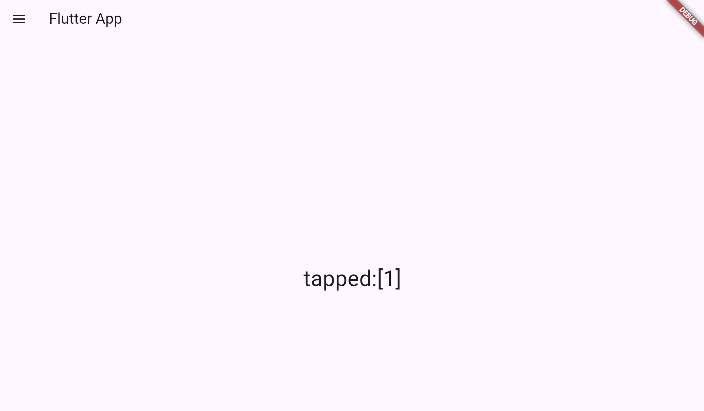

# まとめ

## チートシート

# こんにちは
## おはよう
こんにちは。
***
僕の名前は前原です  　　← 半角スペース2個で改行  
今日は暑いです　　

>アイス食べたい
>>by 前原

```c
int main()
{
    // hogehoge
    return 0;
}
```

c言語で文字を出力するためには`printf`を使います

* サルビア
    * ブーケ
* ユリ
    1. 摘む
    1. まとめる
* ブーゲンビリア

1. 帰る
1. ゲーム
1. 寝る

[Google](https://www.google.co.jp)

今回の講義は***GW明け***のせいかいつも以上に眠い

~~へのへのもへひ~~

| TH1 | TH2 |
|----|----|
| TM1 | TM2 |
| TY1 | TY2 |

| 左揃え | 中央揃え | 右揃え |
|:---|:---:|---:|
|1|2|3|
|4|5|6|

___________________________

```c
home: Scaffold(
        appBar: AppBar(title: Text('Hello Flutter!')),
        body: Text('Hello, Flutter World!!', style: TextStyle(fontSize: 32.0)),
      ),
```


>`Scaffold(スキャフォールド)`
>>アプリケーションの骨組みや基本構造を自動的に生成する機能、足場の意

__________________________


```c
runApp(MyApp());
```

一番最初に表示したい画面の`ウィジェット`を記入  
ウィジェット：アプリの一部を表示し、アプリを起動しなくとも使用できる　　
>ウィジェットを作るときは、何らかのクラスを継承
>>継承：オリジナルのクラスを作るために、もととなるウィジェットを持ってくる。
ステートレスウィジェットを継承
>>>例：乗り物クラス（車クラス（プリウスクラス））


ステートレスウィジェット：親クラスの変更のみに反応

___________________________

```c
appBar: AppBar(title: Text('Hello Flutter!')),
body: Text('Hello, Flutter World!!', style: TextStyle(fontSize: 32.0)),
```

Text：表示される文字　　　　　　  
TextStyle：文字のサイズ

___________________________

>オーバーライド（override）
>>親クラスで定義されたメソッドを子クラスで定義し直し、自分の好きに書き換える


```c
@override
  Widget build(BuildContext context) {
    return MaterialApp(
　　　　　　　　↓
マテリアルデザインのアプリを管理
```
___________________________

```c
class MyApp extends StatelessWidget {
  const MyApp({Key? key}) : super(key: key);
  final title = 'Flutterサンプル';
```
タイトルの設定  
今回の場合`Flutterサンプル`

___________________________

```c
class MyApp extends StatelessWidget {
  const MyApp({Key? key}) : super(key: key);
  final title = 'Flutterサンプル';
  ```
  表示するメッセージの設定

  _________________________
'
```c
  class _MyHomePageState extends State<MyHomePage> {
  String _message = 'Hello!';

  void _setMessage() {
    setState(() {
      _message = 'タップしました！';
    });
  }
```
`Hello`を表示後、ボタンを押されたら`タップしました！`を表示


___________________________

```c
shouDialog(
  context: 《BuildContext》,
  builder: 《WidgetBuilder》
)
```
`shouDialog`で画面にアラートなどを表示  
`context`で`BuildContext`インスタンスを指定  
　　　　　　　　　↓  
　　　　ウェジットのベースとなる(ダイアログの表示)  
`builder`は表示するウェジットを生成する関数を指定


__________________________

```c
class _MyHomePageState extends State<MyHomePage> {
  static var _message = '分かりました';

  @override
  Widget build(BuildContext context) {
    return Scaffold(
      appBar: AppBar(title: Text('アンケートにご協力ください')),
      body: Center(
        child: Column(
          mainAxisAlignment: MainAxisAlignment.start,
          mainAxisSize: MainAxisSize.max,
          crossAxisAlignment: CrossAxisAlignment.stretch,
          children: <Widget>[
            Padding(
              padding: EdgeInsets.all(20.0),
              child: Text(
                _message,
                style: TextStyle(
                  fontSize: 32.0,
                  fontWeight: FontWeight.w400,
                  fontFamily: "Roboto",
                ),
              ),
            ),

            Padding(padding: EdgeInsets.all(10.0)),

            Padding(
              padding: EdgeInsets.all(10.0),
              child: ElevatedButton(
                onPressed: buttonPressed,
                child: Text(
                  "次のうちどちらかを選んでください",
                  style: TextStyle(
                    fontSize: 32.0,
                    color: const Color(0xff000000),
                    fontWeight: FontWeight.w400,
                    fontFamily: "Roboto",
                  ),
                ),
              ),
            ),
          ],
        ),
      ),
    );
  }

  void buttonPressed() {
    showDialog(
      context: context,
      builder:
          (BuildContext context) => AlertDialog(
            title: Text("察してね"),
            content: const Text("どちらのお茶を選びますか？"),
            actions: <Widget>[
              TextButton(
                child: const Text('爽健美茶'),
                onPressed: () => Navigator.pop<String>(context, '爽健美茶'),
              ),
              TextButton(
                child: const Text('綾鷹'),
                onPressed: () => Navigator.pop<String>(context, '綾鷹'),
              ),
            ],
          ),
    ).then<void>((value) => resultAlert(value));
  }

  void resultAlert(String value) {
    setState(() {
      _message = '選ばれたのは: $value でした。';
    });
  }
}

```

表示するメッセージ、選択肢、選択後の表示メッセージの編集


________________________

```c
class _MyHomePageState extends State<MyHomePage> {
  static var _items = <Widget>[];
  static var _message = 'ok.';
  static var _tapped = 0;
```
最初に`ok`を表示

_______________________________

```c
  @override
  void initState() {
    super.initState();
    for (var i = 0; i < 5; i++) {
      var item = ListTile(
        leading: const Icon(Icons.android),
        title: Text('No, $i'),
        onTap: () {
          _tapped = i;
          tapItem();
        },
      );
      _items.add(item);
    }
  }
  ```
  0~4までのページを作成し、`No`+`選択したページ数`の名前をつける


________________________________

```c
  void tapItem() {
    Navigator.pop(context);
    setState(() {
      _message = 'tapped:[$_tapped]';
    });
  }
}
```
`tapped:[選択したページ数]`を画面に表示



_______________________________


```c
class MyHomePage extends StatefulWidget {
  MyHomePage({Key? key}) : super(key: key);
  ```

このコードは、Flutterで画面を作るための「土台」を作っている部分。
- MyHomePage という名前の「部品」（ウィジェット）を作っている。
- `StatefulWidget` で、この画面は「変化できる」タイプの画面となる。（ボタンを押したら色が変わるなど）
- super(key: key); は親（元のルール）をちゃんと引き継ぐためのもの。(　「変化できる箱」 を作っているイメージ　)  
この箱の中身（表示するもの）を別の部分で決めていく。

